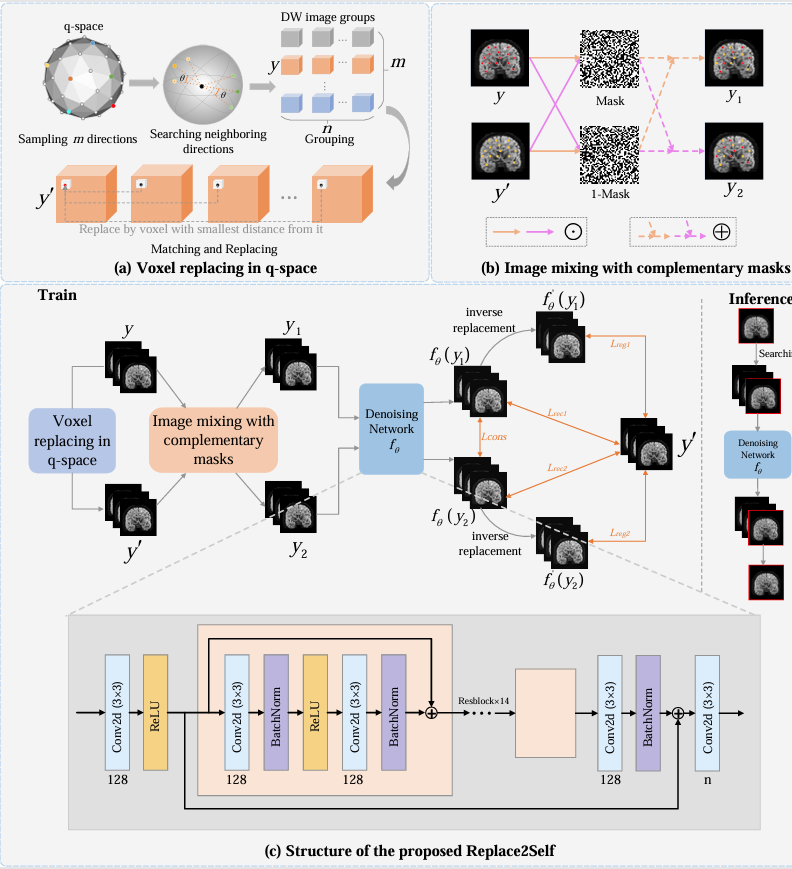

# Replace2Self: Self-Supervised Denoising Based on Voxel Replacing and Image Mixing for Diffusion MRI

[](https://ieeexplore.ieee.org/document/10677833) [](LICENSE)

This repository contains the official implementation of **Replace2Self**, a self‑supervised denoising framework for diffusion‑weighted MRI (dMRI) proposed in the IEEE TMI paper.

> **Replace2Self** effectively removes **spatially correlated noise** in dMRI by leveraging the multi‑directional nature of diffusion data. It introduces a *voxel replacement* strategy based on similar block matching in q‑space, followed by an *image mixing* strategy with complementary masks to generate nearly‑independent noisy image pairs. A lightweight DnCNN backbone is trained with three novel losses: reconstruction loss, complementary‑mask consistency loss, and inverse‑replacement regularization loss. Extensive experiments on simulated and real datasets (including HCP, CoRR, and in‑house data) demonstrate superior denoising performance and generalization ability.

## Overview

Low signal‑to‑noise ratio (SNR) remains a major limitation in diffusion‑weighted imaging, especially for high b‑values. Many existing denoising methods are either supervised (requiring clean targets or multiple acquisitions), or rely on the assumption of spatially independent noise – which is violated in real dMRI due to parallel imaging, multi‑shot acquisitions, and k‑space sampling.

**Replace2Self** addresses these challenges by:

- **Destroying spatial noise correlation** via a voxel replacement strategy that exchanges similar voxels between neighbouring diffusion gradient directions.
- **Reducing signal bias** caused by replacement using an image mixing strategy with complementary binary masks, generating two mixed images as network inputs.
- **Training a self‑supervised denoiser** (DnCNN) with a composite loss that enforces reconstruction fidelity, consistency between the two mixed inputs, and inverse‑replacement regularity.

The method is **independent of network architecture**, robust to different noise distributions (Gaussian, Rician, non‑central Chi), and maintains high performance even when the number of diffusion gradient directions is limited.



*Figure 1: Overall framework of Replace2Self. (a) Voxel replacement based on similar block matching in q‑space. (b) Image mixing with complementary masks. (c) Denoising network with composite losses.*

## Key Contributions

1. **Voxel replacement in q‑space** – destroys spatial noise correlation without sacrificing structural similarity, by matching similar 3D patches across adjacent diffusion directions using the Bray‑Curtis distance.
2. **Image mixing with complementary masks** – produces two distinct but highly similar noisy images, effectively reducing the clean‑signal gap between input and target.
3. **Novel loss functions**:
   - *Reconstruction loss* $L_{rec}$ – masked L2 loss between network outputs and the replaced image $y'$.
   - *Consistency loss* $L_{cons}$ – enforces that the two mixed inputs yield the same denoised output.
   - *Inverse‑replacement regularization loss* $L_{reg}$ – ensures that inversely replacing the denoised voxels back to their original positions is consistent with $y'$.
4. **Outstanding performance** – achieves the highest PSNR on simulated data with various noise levels and distributions, robust fiber orientation reconstruction (lowest AAE), and excellent generalization across different b‑values, numbers of directions, and multi‑center real datasets.

## Method Summary

The training pipeline consists of three stages:

### 1. Voxel Replacement in q‑Space
- For each diffusion direction \(i\), find its \(n-1\) nearest neighbours in q‑space based on gradient directions.
- For each voxel position \(a\), extract a 3D patch around \(a\) from each of the \(n\) DW images (one target direction + \(n-1\) neighbours).
- Compute the Bray‑Curtis distance between the patch of the target direction and each neighbouring patch.
- Replace the center voxel of the target direction with the center voxel of the most similar neighbour. This yields a new image \(y'\) where spatial noise correlation is significantly reduced.

### 2. Image Mixing with Complementary Masks
- Generate a random binary mask $M$ (mask ratio = 50% by default).
- Create two mixed images:
  $ y_1 = M \odot y + (1-M) \odot y' $, $\quad y_2 = (1-M) \odot y + M \odot y' $
- The network inputs are $y_1$ and $y_2$, and the learning target is $y'$.

### 3. Training Losses
Using a denoising network \(f_\theta\) (DnCNN in the paper), the total loss is:
$
L = L_{rec} + \lambda_1 L_{cons} + \lambda_2 L_{reg}
$
In the paper, $\lambda_1 = \lambda_2 = 1$.


## Requirements

- Python 3.8+
- PyTorch 1.9+
- DIPY (for gradient direction handling)
- NumPy, SciPy
- NiBabel (for NIfTI I/O)


## Preprocess, Train and Inference

Replace2Self requires **multi‑direction diffusion‑weighted images** (NIfTI format), together with the corresponding b‑value file (`.bval`) and b‑vector file (`.bvec`). An optional brain mask (NIfTI) can be provided to restrict computation to the brain region.

**Step 1:** Edit the file paths inside `Preprocess.py` to point to your data:


```python
data_file     = "/path/to/your/dwi.nii.gz"
bval_file    = "/path/to/your/dwi.bval"
bvec_file    = "/path/to/your/dwi.bvec"
dataloader_dir   = "./train_test"                      # where .npy files will be saved
```
Then, Run the preprocessing script:
```bash
python Preprocess.py
```

**Step 2:** Run the training script:
```bash
python Main.py
```

**Step 3:** Inference: Denoise new data
```bash
python Denoise.py
```
## Paper Datasets and Evaluation

According to the paper, Replace2Self was evaluated on:

1. **Simulated Phantomas DW data** with Gaussian, Rician, and non-central Chi noise.
2. **HCP WU-Minn diffusion MRI data**.
3. **CoRR(Consortium for Reliability and Reproducibility)**.
4. **In-house dataset**.

The paper reports performance using metrics such as:

- **PSNR**
- **SSIM**
- **Tractography Score** for tensor fitting quality
- **AAE** for fiber orientation accuracy

The uploaded code snapshot mainly reflects the core training prototype and does not yet include a complete public benchmarking pipeline for all datasets in the paper.

## Citation

If you find this work useful, please cite:

```bibtex
@article{wu2025replace2self,
  title={Replace2self: Self-supervised denoising based on voxel replacing and image mixing for diffusion mri},
  author={Wu, Linhai and Wang, Lihui and Deng, Zeyu and Zhu, Yuemin and Wei, Hongjiang},
  journal={IEEE Transactions on Medical Imaging},
  volume={44},
  number={7},
  pages={2878--2891},
  year={2025},
  publisher={IEEE}
}
```

## Contact

For questions about the paper or code, please contact the corresponding authors listed in the manuscript.

## Acknowledgment

This work was supported by the National Natural Science Foundation of China (Grant No. 62161004 and Grant No. 62471296) and the Guizhou  Provincial Science and Technology Projects (Grant QianKeHe ZK [2021] Key 002) and in part
by the National Key Research and Development Program of China under Grant 2024YFC2421100.
